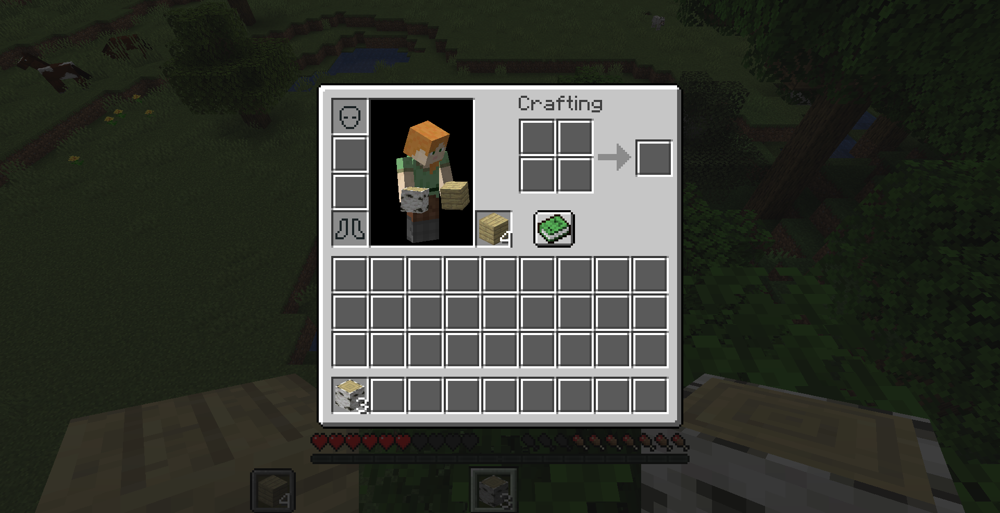

# Locki



A library handling player inventory locking. Can also be used as a standalone mod, through the `/locki` command.

This mod must be installed on both server and client to work properly.

## Overview

Locki represents slots using *inventory nodes*. Inventory nodes are structured as a tree, allowing commands
or mods to quickly lock or unlock entire sections while retaining controls over finer units.
Inventory nodes are represented as a dot-separated path, from least specific ancestor to most specific child node.
For example `inventory` describes the entirety of the player's inventory, while `inventory.armor.chest`
describes the chestplate slot of the inventory.

When an inventory node gets locked, descendant nodes can still be unlocked, allowing you to exclude specific slots
from a broad access ban. For example, locking `inventory` then unlocking `inventory.armor.chest` will prevent the player
from touching any item in their inventory except their chestplate.

### Commands
Locki adds the `/locki` command, allowing server operators and mapmakers to interact with the API through
commands.
- `/locki lock <node> [<targets>] [<lock>]` : locks the inventories of one or more players
    - `<node>` : a full path describing a known *inventory node*.
    - `[<targets>]` (optional) : If specified, must be either a player's username or a target selector. If unspecified, defaults to the player using the command. When used in a command block, player is not optional.
    - `[<lock>]` (optional) : If specified, must be a valid identifier referencing a registered lock. If unspecified, defaults to the generic "command" lock.
- `/locki unlock <node> [<targets>] [<lock>]` : unlocks the inventories of one or more players
    - `[<targets>]` (optional) : If specified, must be either a player's username or a target selector. If unspecified, defaults to the player using the command. When used in a command block, player is not optional.
    - `[<lock>]` (optional) : If specified, must be a valid identifier that was previously used as a lock to affect the players' inventories. If left unspecified, defaults to the generic "command" lock.

#### Permissions
If you have LuckPerms installed, the above commands can be used by players with the `locki.command.lock` permission.
If you only grant `locki.command.lock.self`, players will only be able to use the commands on themselves.

## Interfacing with Locki through Fabric Permissions API

```java
if (Permissions.check(player, "locki.access.inventory.armor.head", true)) {
    // nothing is locking the head slot
}
```
For a list of default inventory nodes, see [DefaultInventoryNodes.java](src/main/java/io/github/ladysnake/locki/DefaultInventoryNodes.java).
Simply prepend the desired node's full path with `locki.access.` before checking.

## Adding Locki to your project

You can add the library by inserting the following in your `build.gradle` :

```gradle
repositories {
	maven { 
        name = "Ladysnake Mods"
        url = "https://ladysnake.jfrog.io/artifactory/mods"
        content {
            includeGroup 'io.github.ladysnake'
            includeGroupByRegex 'io\\.github\\.onyxstudios.*'
        }
    }
    maven {
        name = "Nexus Repository Manager"
        url = 'https://oss.sonatype.org/content/repositories/snapshots'
    }
}

dependencies {
    modImplementation "io.github.ladysnake:locki:${locki_version}"
    include "io.github.ladysnake:locki:${locki_version}"
    // locki dependencies
    include "me.lucko:fabric-permissions-api:${fpa_version}"
    include "com.github.onyxstudios.Cardinal-Components-API:cardinal-components-base:${cca_version}"
    include "com.github.onyxstudios.Cardinal-Components-API:cardinal-components-entity:${cca_version}"
}
```

You can then add the library version to your `gradle.properties`file:

```properties
# Locki
locki_version = 0.x.y
# Fabric Permissions API
fpa_version = 0.1-SNAPSHOT
# Cardinal Components
cca_version = 2.x.y
```

You can find the current version of Locki in the [releases](https://github.com/Ladysnake/Locki/releases) tab of the repository on Github,
and the latest CCA version in the [appropriate repository](https://github.com/OnyxStudios/Cardinal-Components-API/releases).

## Using Locki's API

### Queries

```java
public static boolean isMainHandLocked(PlayerEntity player) {
    return InventoryKeeper.get(player).isLocked(DefaultInventoryNodes.MAIN_HAND);
}
```

### Modifications

```java
public static final InventoryLock MY_LOCK = Locki.registerLock("mymod", "awesome_feature");

public static void toggleInventoryExceptHands(PlayerEntity player) {
    if (MY_LOCK.isLocking(player, DefaultInventoryNodes.INVENTORY)) {
        MY_LOCK.unlockInventory(player);    // equivalent to unlock(player, DefaultInventoryNodes.INVENTORY)
    } else {
        MY_LOCK.lockInventory(player);      // equivalent to lock(player, DefaultInventoryNodes.INVENTORY)
        MY_LOCK.unlock(player, DefaultInventoryNodes.HANDS);
    }
}
```

